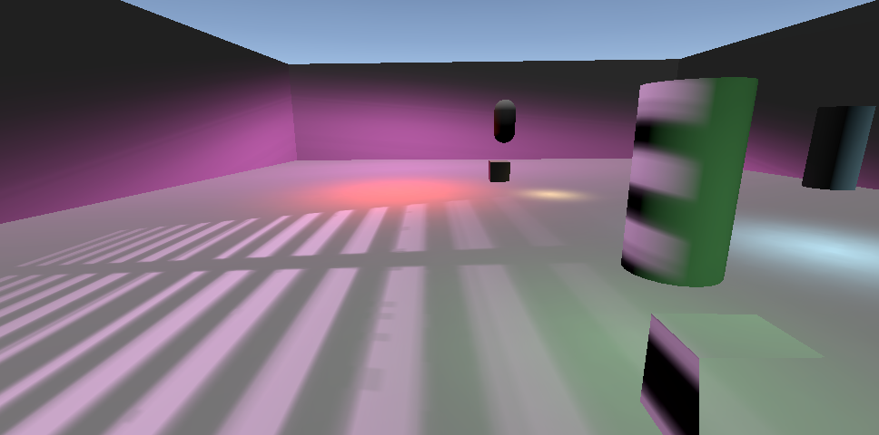

## 说明

基于lightweight srp，实现一些doom2016、doom2020等游戏中用到的特性。

目标是实现一套能在手机上跑的cluster forward渲染管线(最低需要ES3.1)。

基本策略是参考unity的SRP(light weight和HDSRP)以及doom2016、doom2020。

## 特性

- [x] projector灯光支持(仅)
- [x] cluster基本结构支持
- [x] depth pre
- [ ] atlas shadow(texture array对比实验)
- [ ] atlas decal
- [ ] TAA
- [ ] 后处理管线(参考PostProcessLayer，子集bloom,tonemap,colorgrading,dof等)
- [ ] lightmap(环境光only)
- [ ] probe

## 当前结果展示

