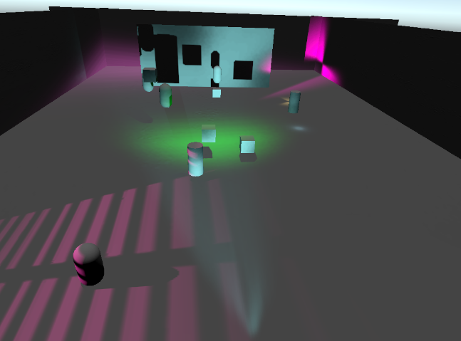

## Description

The aim of this project is to test some features i find in doom2016 and doom2020(or other games) and the pipeline is based on Lightweight SRP.

What's important is that it needs to be running on the phone(ES3.1 need).

Develop environment :Unity 2018.4.12f1 (64-bit) + windowns 10

## Features

- [x] atlas based projector light support(only)
- [x] cluster pipeline basic part
- [x] depth pre
- [x] atlas  based shadow(todo texture array based..compare)
- [ ] atlas  based decal
- [ ] TAA
- [ ] postprocess pipeline(refer UnityPostProcess. bloom,tonemap,colorgrading,dof..)
- [ ] lightmap(environment diffuse only)
- [ ] probe
- [ ] virtual texture based terrain
- [ ] profile and optimize

## Stage result

### 20200512

